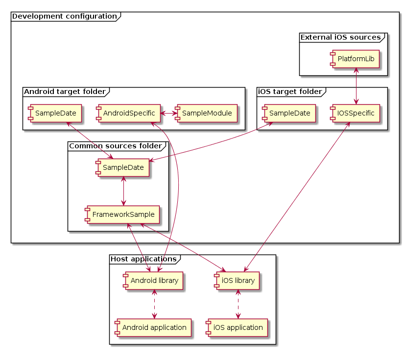

# Kotlin MPP framework development skeleton

This project includes a sample configuration for multi-platform library/framework development in Kotlin, with Android and iOS outputs. It demonstrates how to use existing Java, Objective-C or Swift sources, which are bundled in the output. Also includes the configuration for a fat binary on iOS, which can be useful for the standalone distribution of the framework. Still a work in progress was not tested in release. Feel free to submit issues about any notes or questions!

## Background

During 2019 I have made my master's thesis about the development of a software development kit, which was done in collaboration with a business case provider company. Their goal was to separate the business logic from an existing Android and iOS application in the form of a cross-platform SDK. Kotlin/Native allowed us to reuse parts of the Android implementation on iOS, even though multiplatform programming is still an experimental feature at this point. This repository demonstrates some of the configurations that was required during the development of the SDK.

For full context, feel free to download my thesis from the following link: https://aaltodoc.aalto.fi/handle/123456789/38944

## Updates

- 2020 April: Upgraded to Kotlin version 1.3.60. Simplified configuration example.

## Overview

#### Source location

- `/native/KotlinAndroid` - Development Android application
- `/native/KotlinIOS` - Development iOS application
- `/native/PlatformLib` - Wrapper framework for native iOS sources
- `/ProjectName/src/androidMain/java` - Android specific Java sources
- `/ProjectName/src/androidMain/kotlin` - Android specific Kotlin sources
- `/ProjectName/src/commonMain/kotlin` - Shared Kotlin sources
- `/ProjectName/src/iosMain/kotlin` - iOS specific Kotlin sources
- `/ProjectName/outputs` - Contains the release artifacts.

#### Android library development

Using existing Android sources in Kotlin/Native is relatively simple. Java can be mixed with Kotlin, so just move the existing code in the respective folders under `/ProjectName/src/androidMain`.

The default output of the Android target is an AAR library. The release version is automatically copied to the `/ProjectName/outputs` folder after the build.

#### iOS framework development

Reusing existing source in the iOS target is slightly more complicated. First, the Objective-C or Swift sources needs to be included in the `/native/PlatformLib` Xcode project. By running the `Archive` process in this target, the configuration generates a fat iOS framework which includes both supported architectures. With a helper script, this is automatically copied into the same path where the Xcode project is located. This framework is used as an input for the Objective-C (or Swift) to Kotlin interoperation process in the main project.

After a successful build, the classes in `PlatformLib` can be referenced in the Kotlin sources under `/ProjectName/src/iosMain/kotlin`.

The script of the `ProjectName` framework building process includes custom scripts to generate a fat binary in the output. It also moves the `PlatformLib` framework inside the `ProjectName` framework, which will act as an umbrella. This makes the delivery process easier, as you only have to share the main framework.

## Release build

To generate a release build for iOS, run the `combineIosArchitectures` Gradle task in the root project. For Android, use the `assembleRelease` task in the ProjectName target.

## Sample classes

This diagram displays the connections between the sample classes and the generated outputs. 

## Additional notes

- The API of the kotlin-multiplatform plugin changes frequently, so this sample might be already outdated, as I was working on it a couple months ago. I'll try to update it when I can, but feel free to write me any questions related to the configuration.
- Update: Since 1.3.30 fat framework generation tasks are available. ~~The fat framework generation process of the kotlin-multiplatform output will be easier in the future releases. See: https://github.com/JetBrains/kotlin-native/issues/2574#issuecomment-480264335~~
- Update: Fixed configuration example, no need for generated .def file anymore.~~Currently the .def file for the `PlatformLib` interoperability is generated with a script to include the correct folder paths. This is probably not needed anymore, but I haven't tested a new configuration yet.~~
- On iOS, the simulator architecture probably needs to be removed from the generated fat frameworks before submitting it to the App Store. This wasn't tested, but a similar solution could work: https://medium.com/@crafttang/how-to-upload-an-app-with-universal-framework-to-appstore-49e50a461109
